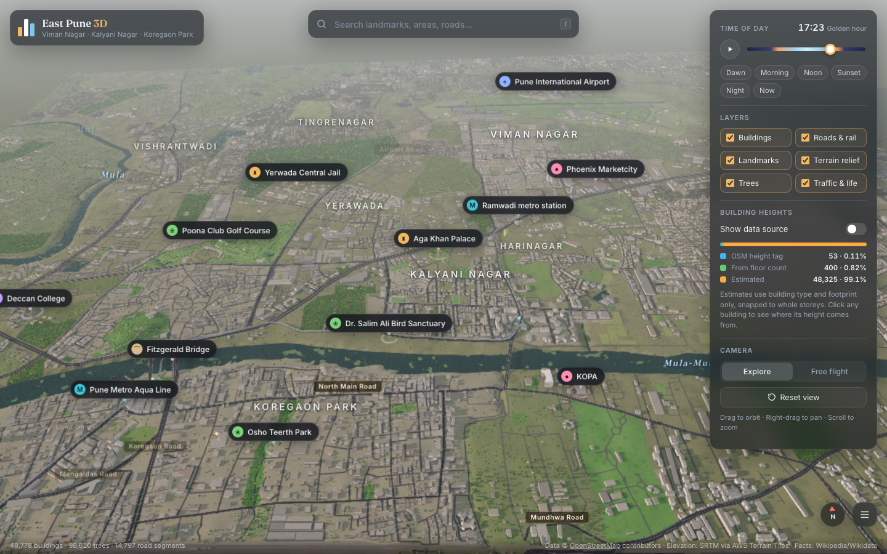
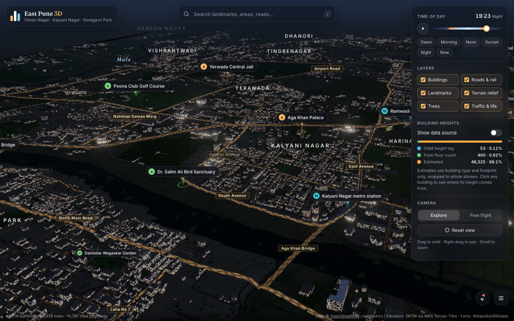
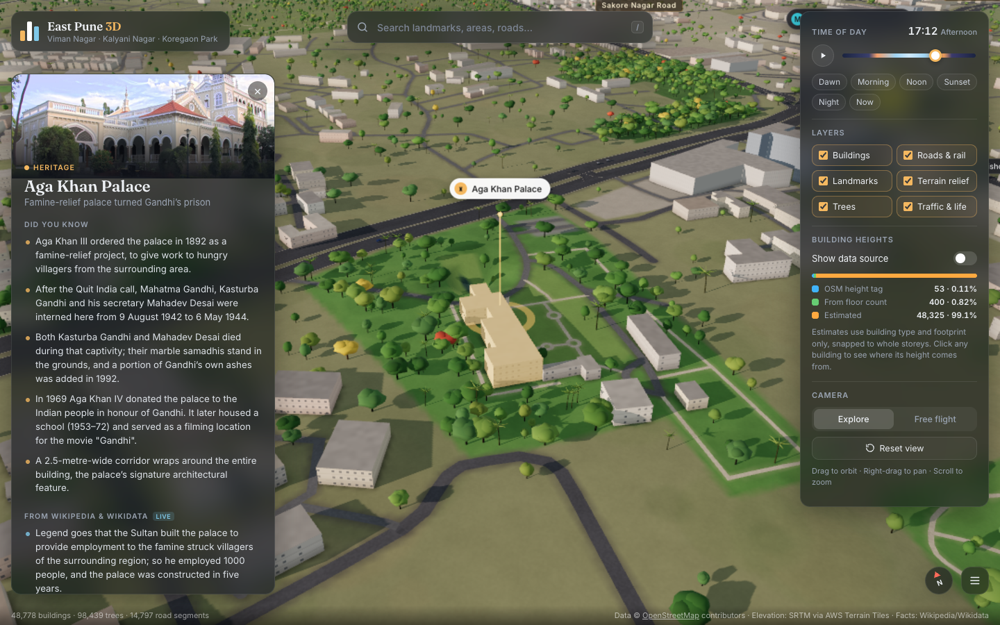
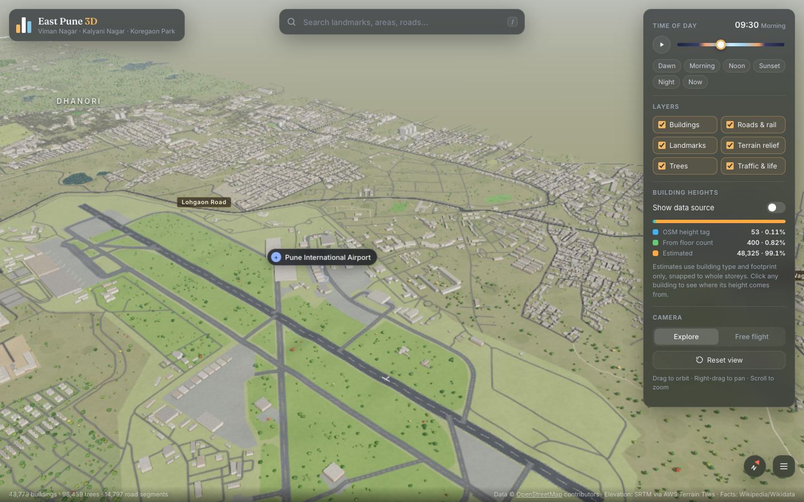

# East Pune 3D

An explorable, browser-based 3D model of East Pune — Viman Nagar, Kalyani Nagar, Koregaon Park, Yerawada, the airport and the Mula-Mutha river corridor — built from real OpenStreetMap data and SRTM elevation.



| Night | Landmark panel | Airport |
| --- | --- | --- |
|  |  |  |

## Run it

```bash
npm install
npm run dev        # http://localhost:3003
```

`npm run build` produces a static site in `dist/` (served with `npm run preview`, also on port 3003).

## What's in the model

Everything is generated from data, not modelled by hand:

- **48,778 building footprints** extruded from OpenStreetMap (ways, multipolygon relations and `building:part`s).
- **~14,800 road segments** with widths by road class, lane markings, kerbs and night-time street lighting. Bridges get decks, parapets and piers.
- **Railways and Pune Metro.** Mainline tracks run at grade. The elevated sections of the Aqua and Purple lines run on a viaduct with piers, and trains run along it. Underground sections are left out.
- **Mula-Mutha and streams** as animated water surfaces, carved into the terrain.
- **Land use** (parks, wood, military land, the airfield, campuses) painted onto a 4K ground texture.
- **Terrain relief** from SRTM elevation (AWS Terrain Tiles), 527–605 m above sea level.
- **~98,000 trees**: mapped OSM trees and tree rows, plus trees scattered by land-use density.
- **31 curated landmarks**, plus every OSM place in the area that links to Wikidata, plus metro stations and neighbourhoods.

Spatial relationships are real: the scene uses a local tangent-plane projection centred on Kalyani Nagar (x = east, z = south, 1 unit = 1 m).

## Building heights: real vs estimated

OpenStreetMap coverage of heights in Pune is thin, and the app says so openly:

| Source | Buildings | How the height is set |
| --- | --- | --- |
| `height` tag | 53 (0.1%) | Used as mapped |
| `building:levels` | 400 (0.8%) | levels × 3.2 m (+ `roof:levels`) |
| Estimated | 48,325 (99.1%) | Coarse fallback by building type and footprint size, snapped to whole storeys |

The estimate never invents precise values. For example, a house is 2 storeys; apartments are 4 or 7 storeys depending on footprint; unknown `building=yes` is 1–4 storeys by footprint area. Toggle **Show data source** to colour every building by where its height comes from. Click any building to see its height, the source badge and a link to edit it on OpenStreetMap.

## Controls

- **Explore mode.** Drag to orbit, right-drag to pan, scroll to zoom (zooms to the cursor).
- **Free flight.** Press `F` or use the camera toggle. `W A S D` to move, `Q`/`E` for down/up, `Shift` to boost, drag to look, scroll to change speed.
- **Search.** Press `/` to search landmarks, neighbourhoods, roads and parks.
- **Time of day.** Use the slider, the presets, or the ▶ time-lapse. The sun position is computed for Pune's latitude and longitude on today's date.
- **Layers.** Toggle buildings, roads & rail, landmarks, terrain relief (animated flatten), trees, and traffic & life.
- **Landmarks.** Click any landmark label or landmark building to open its info panel.

## Landmark facts

Each landmark panel has four parts:

1. **Did you know.** 3–5 hand-checked facts with sources (`src/landmarks-data.js`).
2. **From Wikipedia & Wikidata (live).** Fetched in the browser at click time:
   - The article is split into sentences and scored for "huh" value (firsts, naming origins, historical figures, records). The summary is the fallback.
   - Wikidata claims such as heritage status, "named after", operator and elevation.
3. **From the map data.** Numbers computed from the loaded OSM data: footprints nearby, how many have real heights, the tallest mapped building, ground elevation, distance to the airport, and runway or road lengths.
4. **Nearby on Wikipedia.** A live geosearch for articles close to the landmark.

Responses are cached in `localStorage` for a week.

## Rendering and performance

- **Geometry worker.** A Web Worker downloads the data and does all the heavy work, so the page stays responsive while it loads:
  - triangulates footprints (earcut) and builds merged, indexed meshes per 800 m tile;
  - carves the river;
  - paints the ground texture;
  - scatters trees.
  
  Results come back to the page as transferable typed arrays.
- **LOD.**
  - Each building tile is split into major and minor meshes, and minor buildings are hidden with distance.
  - Trees are instanced per 1.5 km tile, with a near mesh and a low-poly far mesh that share one instance buffer.
  - Tiles far from the camera stop casting shadows.
- **One-draw-call-per-tile buildings.** Windows, floor lines, night lighting, base ambient occlusion and the data-source view are all procedural in the shader. There are no textures and no extra geometry.
- **Terrain relief as a shader displacement.** An `elev` attribute scaled by one uniform, so the terrain toggle animates everything at once. Shadow and picking passes use the same displacement.
- **GPU picking.** On click, a 1×1 ID render resolves which of the ~49k buildings is under the cursor.
- **Reversed-Z depth buffer** (where supported) plus an adaptive near plane, for artefact-free depth from street level up to 16 km.
- **Lighting.**
  - Texel-snapped shadow frustum that follows the camera.
  - Dynamic resolution scaling to hold the frame rate.
  - Preetham sky, drifting procedural clouds, stars and moon.
  - Gradient-dome image-based lighting.
  - ACES tone mapping and selective bloom for lights at night.

## Refreshing the data

```bash
npm run data        # fetch from Overpass + AWS Terrain Tiles, then rebuild public/data
npm run data:build  # rebuild public/data from the cached raw downloads only
```

The bounding box and projection live in `scripts/config.mjs`. Raw downloads are cached in `data/raw/` (git-ignored). Landmark positions are resolved against OSM names at build time, with the lat/lon in `src/landmarks-data.js` as fallback.

## Project layout

```
scripts/            data pipeline (Overpass + elevation → compact JSON)
public/data/        generated data loaded by the app
src/main.js         app wiring: renderer, loading, landmarks, picking, UI, loop
src/world/          worker, materials/shaders, sky & lighting, city meshes, traffic
src/ui/             labels, info panel, search
src/facts.js        Wikipedia / Wikidata clients
```

## Known limitations

- Most heights are estimates (see above). The model can only be as good as OSM coverage.
- The Dr. Salim Ali Bird Sanctuary isn't mapped in OSM, so its marker uses an estimated riverbank position.
- The elevation is SRTM-derived (roughly 30 m resolution, surface model), so small undulations are approximate.
- Wikipedia can rate-limit heavy use; panels then fall back to curated and map-derived facts.

## Credits and licences

- Map data © [OpenStreetMap](https://www.openstreetmap.org/copyright) contributors, available under the ODbL.
- Elevation: [AWS Terrain Tiles](https://registry.opendata.aws/terrain-tiles/) (SRTM and others).
- Facts: Wikipedia (CC BY-SA) and Wikidata (CC0).
- Built with [three.js](https://threejs.org), [earcut](https://github.com/mapbox/earcut) and [Vite](https://vitejs.dev).
- Code: MIT.
